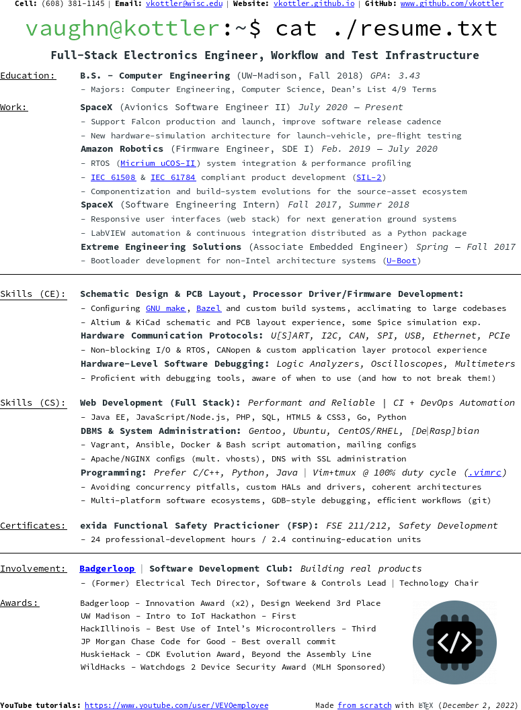

# My Resume

Source assets for my LaTeX resume.

## Development Environment & Dependencies

* [Ubuntu GNOME](https://ubuntugnome.org/) 16.04 LTS
* `latex` - Package, compile `*.tex` into `*.dvi`
* `pdflatex` - Package, compile `*.tex` directly into `*.pdf`
* `xdvi` - Package, view raw `*.dvi` files
* `dvipng` - Package, convert `*.dvi` into a PNG file
* `evince` - PDF Viewer (GNOME Default)
* `eog` - Image Viewer (GNOME Default)

## Usage (See [Makefile](Makefile))

* `make pdf` compiles the current source into a PDF
* `make png` compiles the current source into a PNG
* `make clean` removes all intermediate files and artifacts

## Latest Snapshot

